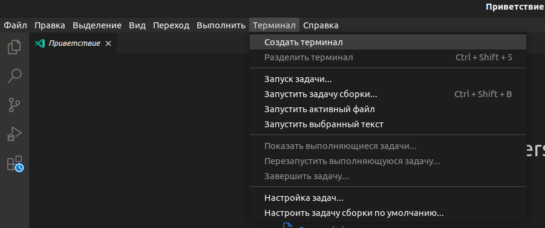
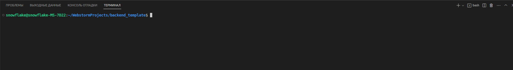
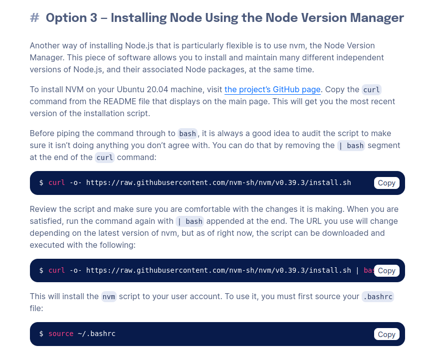
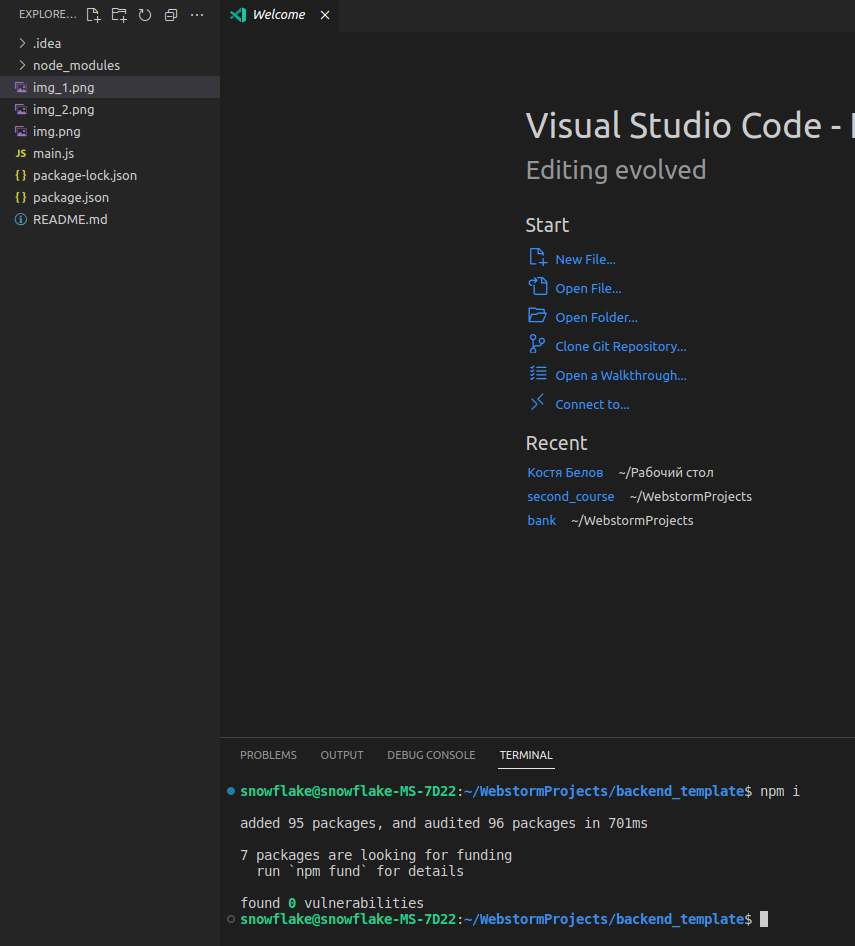
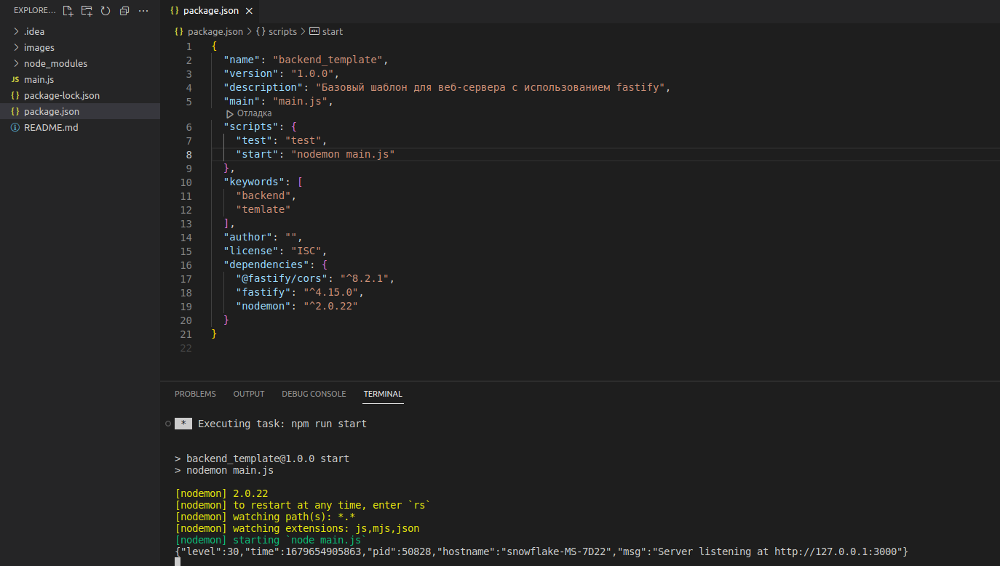

### Как развернуть проект
1. Открыть терминал

2. Убедиться, что в терминале выбрана папка с проектом (путь должен оканчиваться на название проекта)

3. Проверить версию node js.
    
   В терминал ввести команду ``node -v``  
4. Минимальная версия ``node js`` для работы ``16.14.2``

    Если версия ``node js`` меньше - необходимо выполнить установку более новой версии.

    Для этого перейти по ссылке https://www.digitalocean.com/community/tutorials/how-to-install-node-js-on-ubuntu-20-04 и перейти к 3 шагу

    

    После установки nvm нужно выполнить команды ``nvm install 18.10.0`` и ``nvm use 18.10.0``

    Далее повторно ввести команду ``node -v`` и проверить, что версия ``node js = 18.10.0`` 
5. После проверки версии ``node js`` нужно установить пакеты, для этого необходимо выполнить команду ``npm i``

   При успешной установке пакетов в терминале должна вывестить информация о том, что пакеты установлены, также в папке проекта должна появится папка ``node_modules``

   

6. Далее нужно перейти в ``package.json`` и запустить скрипт с названием ``start``. Если все хорошо, то вы терминале должна появится следующая информация

   

